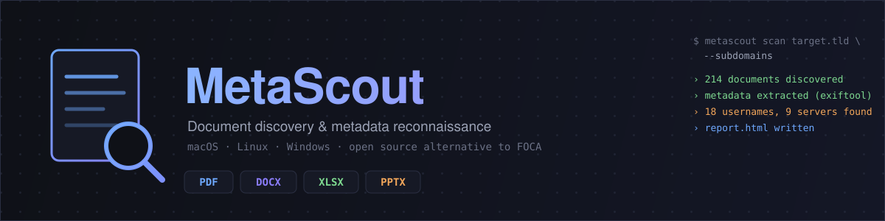

<p align="center">
  
</p>

<p align="center">
  
  
  
  
</p>

<p align="center">
  Open-source, cross-platform document discovery and metadata leak analysis tool.<br>
  Designed as a spiritual successor to <a href="https://github.com/elevenpaths/foca">FOCA</a>, without the Windows lock-in.
</p>

<p align="center"><sub>🇬🇧 English · <a href="README.tr.md">🇹🇷 Türkçe</a></sub></p>

<p align="center">
  ⭐ If MetaScout is useful to you, consider starring the repo — it helps others find it too.
</p>

---

## Table of contents

- [What is this?](#what-is-this)
- [Features](#features)
- [Installation](#installation)
  - [Requirements](#requirements)
  - [macOS](#macos)
  - [Linux](#linux)
  - [Windows](#windows)
  - [Verify the install](#verify-the-install)
  - [Global install (pipx)](#global-install-pipx)
- [Quick start](#quick-start)
- [Scanning multiple targets](#scanning-multiple-targets)
- [Scanning a manual URL list](#scanning-a-manual-url-list)
- [Web UI](#web-ui)
- [Docker (web UI)](#docker-web-ui)
- [Wayback Machine discovery](#wayback-machine-discovery)
- [Keyless search with DDGS](#keyless-search-with-ddgs)
- [Subdomain enumeration](#subdomain-enumeration)
- [Content scanning for personal data (PII)](#content-scanning-for-personal-data-optional)
  - [Visual (wet) signature detection](#visual-wet-signature-detection--experimental-separately-opt-in)
- [Search engine API keys](#search-engine-api-keys-optional)
- [Full CLI reference](#full-cli-reference)
- [Output layout](#output-layout)
- [Architecture](#architecture)
- [Testing](#testing)
- [Troubleshooting](#troubleshooting)
- [Responsible use](#responsible-use)
- [License](#license)

## What is this?

[FOCA](https://github.com/elevenpaths/foca) was the go-to tool for metadata-based
information leakage testing for years, but it's unmaintained now and
Windows-only. **MetaScout** rewrites the same idea (find documents published on
a target site, extract their metadata, report what leaks) in Python: a fully
command-line tool that installs the same way on macOS, Linux, and Windows.

It discovers PDF/Office documents published on a target, downloads them,
extracts their metadata with [ExifTool](https://exiftool.org/), and reports:

- **Usernames** (document authors, last-modified-by, home directory paths)
- **Email addresses**
- **Software / version info** (Office build, PDF producer, etc.)
- **Operating system** hints
- **Internal file paths** (`C:\Users\...`, network shares)
- **Server / printer names** (UNC paths, `\\server\share`)

## Features

- **Multiple document discovery methods**: direct site crawling, `sitemap.xml`/`robots.txt`
  parsing, the Wayback Machine's archive (finds files no longer live on the
  site), and optional search engine dorking (Google/Serper/Brave `site: filetype:`)
- **Multi-target scanning**: scan dozens of domains belonging to one organization
  in a single run and get one merged report
- **CLI and local web UI**: `metascout scan` from the terminal, or `metascout
  web` for a browser form
- **Passive subdomain enumeration** via [crt.sh](https://crt.sh) (Certificate
  Transparency logs), no API key required, each subdomain gets scanned too
- **Respects `robots.txt` by default** and sends an honest, non-spoofed User-Agent
- **Concurrent downloads** with a size cap and sha256 deduplication
- **Detailed HTML report** (dark theme, findings grouped by category, English
  or Turkish) plus a **JSON report** for automation
- **Opt-in document *content* scan** for personal/critical data — national ID
  numbers, emails/phones, IBANs/card numbers, address/DOB hints, and
  signature hints — on top of the always-on metadata scan (see
  [Content scanning for personal data](#content-scanning-for-personal-data-optional))
- No exotic dependencies: the only native component is `exiftool`, available
  on every platform

## Installation

### Requirements

- Python 3.10 or newer
- [ExifTool](https://exiftool.org/) (required for metadata extraction)
- Git (optional, to clone the repo)

### macOS

```bash
# No Homebrew? https://brew.sh
brew install exiftool python@3.12 git

git clone https://github.com/gorkemguler/metascout.git
cd metascout
python3 -m venv .venv
source .venv/bin/activate
pip install -e .
```

On MacPorts, use `sudo port install p5-image-exiftool` instead.

### Linux

**Debian / Ubuntu**

```bash
sudo apt update
sudo apt install -y libimage-exiftool-perl python3-venv python3-pip git

git clone https://github.com/gorkemguler/metascout.git
cd metascout
python3 -m venv .venv
source .venv/bin/activate
pip install -e .
```

**Fedora / RHEL / CentOS**

```bash
sudo dnf install -y perl-Image-ExifTool python3 git

git clone https://github.com/gorkemguler/metascout.git
cd metascout
python3 -m venv .venv
source .venv/bin/activate
pip install -e .
```

**Arch Linux**

```bash
sudo pacman -S perl-image-exiftool python git

git clone https://github.com/gorkemguler/metascout.git
cd metascout
python3 -m venv .venv
source .venv/bin/activate
pip install -e .
```

### Windows

**1. Install Python**

Download Python 3.10+ from [python.org/downloads](https://www.python.org/downloads/).
On the installer screen, make sure **"Add python.exe to PATH"** is checked.

**2. Install ExifTool** (pick one)

- **Chocolatey** (in an elevated PowerShell):
  ```powershell
  choco install exiftool
  ```
- **Scoop**:
  ```powershell
  scoop install exiftool
  ```
- **Manual**: download the "Windows Executable" zip from [exiftool.org](https://exiftool.org/),
  rename the extracted `exiftool(-k).exe` to `exiftool.exe`, and either copy it
  into a folder already on PATH (e.g. `C:\Windows\`) or add its folder to the
  system PATH (`Settings › System › Advanced system settings › Environment
  Variables`).

**3. Install the project** (PowerShell)

```powershell
git clone https://github.com/gorkemguler/metascout.git
cd metascout
python -m venv .venv
.venv\Scripts\Activate.ps1
pip install -e .
```

> If PowerShell blocks script execution (`.venv\Scripts\Activate.ps1 cannot be
> loaded`), run this once as your own user (no admin needed):
> `Set-ExecutionPolicy -Scope CurrentUser RemoteSigned`

Using plain `cmd.exe` instead? Activate with `.venv\Scripts\activate.bat`.

### Verify the install

On any platform, with the virtual environment active:

```bash
exiftool -ver
metascout scan --help
```

If both print version/help text without errors, you're set.

> **Note:** `pip install -e .` installs the `metascout` command only into
> whichever `.venv` was active at the time. Open a new terminal, or run
> `metascout` from outside the project directory, and you'll get `zsh:
> command not found: metascout` (or `'metascout' is not recognized...` on
> Windows). That's not broken, the venv just isn't active. Either activate
> it each time (`source .venv/bin/activate`) or install it globally below.

### Global install (pipx)

If you'd rather run `metascout` from anywhere without activating a venv every
time, use [pipx](https://pipx.pypa.io/): it installs the package into its own
isolated environment but puts the command on your PATH.

```bash
# macOS
brew install pipx
pipx ensurepath

# Debian/Ubuntu
sudo apt install pipx
pipx ensurepath

# Windows (PowerShell)
python -m pip install --user pipx
python -m pipx ensurepath
```

After `pipx ensurepath`, **restart your terminal** (or run `exec zsh` / `exec
bash`), then install from the project directory:

```bash
pipx install --editable /full/path/to/metascout
```

`--editable` means code changes under `src/metascout/` take effect
immediately, no reinstall needed. After this, `metascout` works from any
directory without activating a venv.

## Quick start

```bash
metascout scan example.com
```

By default this uses site crawling (`crawl`), `sitemap.xml`, the [Wayback
Machine](#wayback-machine-discovery), and [DDGS](#keyless-search-with-ddgs) —
no API key needed for any of them. Results are written to
`./metascout_output/report.html` and `report.json`.

```bash
metascout scan example.com \
  --filetypes pdf,docx,xlsx \
  --max-docs 100 \
  --max-crawl-pages 500 \
  --output-dir ./out
```

## Scanning multiple targets

Scan several domains belonging to the same organization in one run and get a
**single merged report**, no need to run the tool repeatedly and stitch
reports together yourself:

```bash
metascout scan example.com example.org another-example.net
```

For a longer list, put them in a file and use `--targets-file` (one domain
per line, `#` starts a comment):

```bash
cat > domains.txt <<EOF
# Acme Corp domains
example.com
example.org
another-example.net
EOF

metascout scan --targets-file domains.txt --subdomains
```

When more than one target is given, the generated `report.html`/`report.json`
includes a **"Targets"** table breaking down how many documents were found per
domain.

## Scanning a manual URL list

If a discovery engine didn't work for you (blocked API, exhausted quota,
whatever) and you ended up gathering a list of document URLs by hand — from a
browser search, another tool, anywhere — feed that list straight in with
`--urls-file`. Discovery is skipped for those; they're downloaded, analyzed,
and included in the report exactly like anything else the engines find:

```bash
cat > urls.txt <<EOF
# gathered manually, google engine was rejected
https://example.com/reports/2023-annual.pdf
https://example.com/files/internal-notes.docx
EOF

metascout scan --urls-file urls.txt
```

TARGETS can be omitted when `--urls-file` is used — the hostnames of those
URLs become the targets automatically (used for the report header and the
per-target breakdown). Pass TARGETS or `--targets-file` as well to also run
normal discovery alongside the manual list; results are merged and deduped
by URL, so a document already found by an engine won't be listed twice just
because it's also in your manual file. The web UI has the same field under
"Manuel URL listesi".

## Web UI

If you'd rather fill out a browser form than type CLI flags:

```bash
metascout web
```

This opens a local UI at `http://127.0.0.1:8765/` (launches in your browser
automatically), in English by default — click **TR** in the top-right corner
to switch the whole page to Turkish (`EN`/`TR`, also reachable directly via
`?lang=tr`). Enter your targets (one per line), an optional manual URL list
(see [Scanning a manual URL list](#scanning-a-manual-url-list) — leave
targets empty and it'll derive them from the URLs), file extensions,
discovery engines, the subdomain toggle, and the report language (English or
Turkish, independent of the page's own language), then hit "Start scan".
While it's running, a live log box under the button streams the same
progress lines you'd see in the terminal (documents found, engines queried,
content-scan/visual-signature progress, ...) via server-sent events, so a
long scan doesn't just look frozen behind a spinner. When the scan
finishes, the report opens right in the browser with a **"Download results
(.zip)"** button in the top-right corner — bundles that run's
`report.html`, `report.json`, and every downloaded document into one zip,
so getting the full output onto your own machine doesn't need filesystem
access to wherever `metascout web` is actually running. The same files are
also saved as-is under `--output-dir` (default
`./metascout_output/web-<timestamp>/`).

```bash
metascout web --port 9000 --output-dir ~/metascout-workspace/metascout_output
```

The UI only listens on `127.0.0.1` by default (change with `--host`). To
use the `google`/`serper`/`brave` checkboxes, the matching API keys need to
be set via environment variable or `.env` (see [Search engine API
keys](#search-engine-api-keys-optional)).

> ⚠️ **This has no authentication, at all.** Fine for one person on their
> own machine (the default). If you're tempted to run `metascout web
> --host 0.0.0.0` so a team can share one instance: don't, not directly —
> anyone who can reach it can start scans (against any target they choose,
> using your server/IP) and download every other run's results, including
> ones containing real PII if `--scan-content` was used. Put it behind
> something that actually authenticates users first — a reverse proxy with
> basic auth, a Tailscale/WireGuard-only network, an SSO-aware gateway —
> before letting more than one trusted person reach it.

**"Scan Existing Documents"** (top nav) is a second, separate page for a
different case: you already have documents — your own files, or ones
gathered some other way — and just want them analyzed, with no target and
no discovery. Give it either a local directory path (searched recursively)
or a URL list (downloaded directly, no discovery), plus optional
content-scan and visual-signature checks, same as the main form. It's kept
on its own page rather than crammed into the main form specifically to keep
that one from getting harder to read as more scan options get added.

## Docker (web UI)

For running the web UI without setting up Python/ExifTool/ImageMagick/
Ghostscript by hand, or for putting it somewhere other than your own
laptop:

```bash
git clone https://github.com/gorkemguler/metascout.git
cd metascout
docker build -t metascout .
docker run --rm -p 127.0.0.1:8765:8765 -v "$(pwd)/metascout_output:/data" metascout
```

Or with `docker-compose.yml` (included in the repo):

```bash
docker compose up --build
```

Either way, `http://localhost:8765` on your machine reaches the container's
web UI once it's running, and every scan's output (`report.html`,
`report.json`, `downloads/`) lands in `./metascout_output` on the host
through the volume mount — persisted across container restarts, and
reachable without `docker exec`-ing into the container.

The image bundles **everything**, including the optional `content-scan`
and `visual-signature` extras (ImageMagick + Ghostscript included) — no
separate `pip install` step needed inside the container. That's a real
tradeoff: the image is meaningfully bigger than a bare `pip install
metascout` because of it (see [Visual (wet) signature
detection](#visual-wet-signature-detection--experimental-separately-opt-in)
for why those two alone add real weight), traded for genuinely working out
of the box.

API keys (`GOOGLE_API_KEY`, `SERPER_API_KEY`, `BRAVE_API_KEY`, ...) work the
same way as everywhere else in this project — copy `.env.example` to `.env`,
fill in what you have, and either pass `--env-file .env` to `docker run` or
uncomment the `env_file:` line in `docker-compose.yml`.

> ⚠️ **Same warning as the [Web UI](#web-ui) section, worth repeating here
> because Docker is exactly where people reach for `--host 0.0.0.0`:** this
> image has no authentication built in. The `docker run`/compose examples
> above bind the published port to `127.0.0.1` on the host on purpose —
> only reachable from the machine running the container. If you're
> deploying this somewhere other people should reach (a shared server, a
> cloud VM), put an authenticating reverse proxy in front of it first;
> don't just publish the port to `0.0.0.0` or a public interface. Anyone
> who can reach an unauthenticated instance can start scans against
> whatever target they choose using your server, and download every
> previous run's results — PII included, if `--scan-content` was used.

## Wayback Machine discovery

The `wayback` engine (on by default, no API key needed) queries the [Wayback
Machine](https://web.archive.org)'s CDX Server API for every document
archive.org has ever captured under a target host — including files that
were later removed, unlinked, or made unreachable on the live site. This
often surfaces old reports, drafts, or internal documents that crawling the
current site would never find.

```bash
metascout scan example.com --engines wayback
```

It's scoped to exactly the host you pass (no automatic subdomain expansion —
use `--subdomains` for that, same as the other engines). If `web.archive.org`
is unreachable from your network (some ISPs block it), the engine just
returns no results for that host; the rest of the scan is unaffected.

Each result is reported under its original live-site URL — the same URL
crawl, sitemap, or a dork engine would report for the same file — so a
document found by more than one engine still shows up once in the report,
not twice. Since that original URL is often exactly what's gone, MetaScout
also keeps the actual archive.org snapshot address behind the scenes and
downloads from there automatically if fetching the original URL fails.

## Keyless search with DDGS

The `ddgs` engine wraps [DDGS](https://pypi.org/project/ddgs/), a Python
library that scrapes DuckDuckGo (and, with its default `auto` backend, falls
back across Bing, Brave, Google, Yandex, and others) for `site:`/`filetype:`
results with **no API key or account at all**:

```bash
metascout scan example.com --engines ddgs
```

Unlike the other keyless engines (`wayback`, `crawl`, `sitemap`), this one is
a scraper rather than an official API, so it's the most fragile option here
in principle — results depend on whatever DDGS's maintainers currently keep
working against each engine's anti-bot defenses, and sustained use can get
rate-limited. In practice it's been fast and reliable in testing (e.g. 26
real PDFs found in ~2 seconds against a real target, no errors across
repeated runs), so it's part of the **default** engine set. Drop it from
`--engines` (or uncheck it in the web UI) if you'd rather not depend on a
scraper.

Pick which engine(s) DDGS itself queries with `--ddgs-backend` (default
`auto`; also accepts a single engine like `duckduckgo`, `google`, or `bing`,
or a comma-separated list to try in order). Notably, `--ddgs-backend google`
gets you real Google search results — the same source `google_dork_search`
and Serper both hit — with **no API key at all**. The engine walks multiple
result pages per filetype (with retries/backoff on failed pages) to get past
DDGS's own one-page-per-call limit, but Google's scraping defenses push back
hard on this in practice: across repeated live tests against the same real
target, a single dork went from 26 results (one page, no pagination) up to
anywhere between 50 and 114 out of ~300 real matches with pagination enabled
— and occasionally 0, when Google was mid-block. Treat `ddgs`+`google` as a
free, no-setup way to grab a partial sample or unblock a one-off query, not
as a volume-complete substitute for `serper` or Google's own (soon
discontinued) API — see [Search engine API keys](#search-engine-api-keys-optional)
below for those. The same field is exposed in the web UI as "DDGS backend".

## Subdomain enumeration

`--subdomains` performs passive subdomain discovery via [crt.sh](https://crt.sh)
(Certificate Transparency log search, no API key required); every discovered
subdomain is scanned with the same document-discovery engines (crawl/sitemap/google/serper/brave):

```bash
metascout scan example.com --subdomains --max-subdomains 30
```

`crt.sh` can be slow or rate-limited at times. In that case the scan silently
continues with an empty subdomain list; the scan of the main domain is unaffected.

## Content scanning for personal data (optional)

Everything above scans document **metadata** (author, software, file paths —
tags exiftool pulls out). `--scan-content` goes further and reads each
downloaded document's actual **body text**, looking for personal/critical
data:

| Category | What it detects | Confidence |
|---|---|---|
| `tc_kimlik` | Turkish national ID numbers | High — checksum-validated (invalid numbers are filtered out) |
| `email_phone` | Emails (regex) and phone numbers (via [`phonenumbers`](https://pypi.org/project/phonenumbers/), Google's libphonenumber port — international, not TR-only) | High for phones (library-validated) |
| `iban_card` | IBANs (any ISO 13616 country, not just Turkey) and card numbers | High — mod-97 (IBAN) / Luhn (card) checksum-validated |
| `address_dob` | Address-like and date-of-birth-like text patterns | **Low** — regex heuristics, expect false positives |
| `signature` | "imza"/"signature"/"signed by"-style keywords in the text, **and** whether a PDF has an actual cryptographic signature field (`/Sig`) | Keyword hits are a hint, not proof; the structural `/Sig` check is reliable |

It's off by default, opt-in, and heuristic — every hit is something to
**verify manually**, not a confirmed leak the way a metadata finding is.

```bash
pip install 'metascout[content-scan]'   # one-time: pulls in pypdf + phonenumbers
metascout scan example.com --scan-content
# or a subset:
metascout scan example.com --scan-content --content-categories tc_kimlik,iban_card
```

The same toggle and category checkboxes are available in the web UI, under
"Scan document content for personal/critical data (PII)" — unchecked by
default. If you enable it without installing the extra, the scan still runs
and logs which dependency is missing instead of failing outright; PDF text
extraction and phone-number detection specifically need `pypdf` and
`phonenumbers` respectively, everything else (Office/OpenDocument text
extraction, email/TC-no/IBAN/card regex, signature keywords) works without
them.

**Privacy in the report itself:** the more sensitive categories are masked
at detection time — a TC no. shows as `123******78`, a card number as
`************1111`, an IBAN keeps only its first/last 4 characters — so the
report and its JSON export never become a plaintext store of the actual
values. Emails/phones and the weak address/DOB hints are shown as found,
since that's already the point of surfacing them.

Text extraction covers PDF (via `pypdf`), `.docx`/`.xlsx`/`.pptx`, and
`.odt`/`.ods`/`.odp`. Legacy binary Office formats (`.doc`/`.xls`/`.ppt`)
aren't supported — they'd need a much heavier dependency (`olefile`) for
comparatively rare wins, so they're skipped (metadata scanning still works
on them as normal).

### Visual (wet) signature detection — EXPERIMENTAL, separately opt-in

Everything above, including the `signature` category, only sees a document's
*text* — a keyword like "signed by" in the body, or a PDF's `/Sig` field.
None of that catches a **scanned page with a handwritten signature and no
text layer at all**. `--visual-signature` adds that: it rasterizes each
page and runs the [`signature-detect`](https://github.com/EnzoSeason/signature_detection)
heuristic image pipeline (brightness threshold → connected-component
extraction → aspect-ratio/pixel-density judgement) to flag ink blobs shaped
like a handwritten signature.

This is opt-in on **two independent levels** by design, and — unlike the
`signature` text/keyword category — **does not require `--scan-content`**;
it's its own switch that works with or without the rest of content scanning:

```bash
pip install 'metascout[visual-signature]'
metascout scan example.com --visual-signature
```

1. Installing `pip install 'metascout[visual-signature]'` alone does
   **nothing** — you still need `--visual-signature` on the command (or the
   checkbox in the web UI) to actually run it.
2. It's a genuinely heavier dependency than the rest of this project. On top
   of the pip package, it needs **ImageMagick and Ghostscript installed
   system-wide** (Wand shells out to ImageMagick, which delegates PDF
   rasterization to Ghostscript) — confirmed live: without Ghostscript, it
   fails outright with a `DelegateError`. Expect ~150–250MB of native
   libraries on top of the usual install.

**Run it later instead of inline.** This check is slow enough (see below)
that most scans shouldn't wait on it. `metascout visual-signature-scan`
runs it separately, afterward, against documents a normal scan already
downloaded — no re-discovery, no re-download:

```bash
metascout scan example.com                    # fast, as usual
metascout visual-signature-scan ./metascout_output   # slow, run whenever you want
```

It reads `report.json` from the given output directory, checks every
successfully-downloaded document, prints a results table, and writes
`visual_signature_report.json` next to it.

**Live test results (real corpus, EXPERIMENTAL status confirmed):** run
against 162 real PDFs collected during an authorized scan (form documents,
announcements, and financial reports), the first 76 processed before the
run was stopped for time:

| | Count |
|---|---|
| Flagged as containing a visual signature | 26 (34%) |
| Flagged as not containing one | 50 (66%) |
| Runtime errors | 0 |

Manually reviewing a sample of the flagged documents (with the real
filenames/target omitted here — this project doesn't publish which specific
documents belong to whom) found **both outcomes**: a document with a real
company stamp and handwritten signature was correctly flagged, but so were
two completely blank form templates — one because of its printed "Signature:"
label and checkbox-grid borders, the other because of a logo and a diagonal
watermark. This is exactly the kind of false positive the "heuristic,
verify manually" warning above is about — **treat every hit as something to
look at, not a confirmed signature.**

**Runtime, measured on that same run**: from well under a second up to
**131 seconds** for a single large multi-page financial report, dominated by
Ghostscript's PDF rasterization at 200 DPI per page. The 76-document sample
took about 1 hour 21 minutes in total — budget accordingly, and prefer
`visual-signature-scan` on a curated subset over `--visual-signature` on an
entire large scan.

Other things worth knowing before turning this on:

- The upstream project has been **unmaintained since October 2022** and
  already triggers a `FutureWarning` against current scikit-image (suppressed
  here, but it's a real signal the algorithm's dependencies are aging).
- Detection is heuristic and parameter-sensitive: the default aspect-ratio
  window rejects very wide/flat signature shapes, so real signatures can be
  missed depending on scan quality and signing style — verified live with
  synthetic test images (a compact signature-shaped stroke was correctly
  flagged; the same stroke stretched wider was not).
- If the check can't run at all (dependency missing, Ghostscript missing, a
  corrupt file) it's treated as "couldn't confirm," not "no signature" —
  nothing gets added to the report for that page rather than a false negative
  being reported as a hit.
- Install ImageMagick/Ghostscript the same way as `exiftool`:
  `brew install imagemagick ghostscript` (macOS),
  `apt install imagemagick ghostscript` (Debian/Ubuntu), or the official
  Windows installers from [imagemagick.org](https://imagemagick.org/script/download.php#windows)
  and [ghostscript.com](https://www.ghostscript.com/releases/gsdnld.html).

## Search engine API keys (optional)

The `google`, `serper`, and `brave` engines run classic FOCA-style
`site:target filetype:pdf` dork searches; each needs an API key:

```bash
cp .env.example .env
# fill in GOOGLE_API_KEY, GOOGLE_CSE_ID and/or BRAVE_API_KEY
```

Once a key is set, the matching `google`/`serper`/`brave` engine turns on **automatically**,
no extra step needed (added to the CLI's default `--engines` list, and its
checkbox is pre-checked in the web UI). Passing `--engines` explicitly
overrides this auto behavior, so you'd list the engines you want yourself.

> **Security note:** `.env` is already in [.gitignore](.gitignore), so even if
> you keep it in this repo folder, `git add .` won't pick it up. Still, the
> safest setup is to keep your real keys in a **separate folder outside the
> git repository entirely**, e.g. `~/metascout-workspace/.env`. If you
> [install metascout globally with pipx](#global-install-pipx), `metascout
> scan` reads the `.env` from whatever directory you run it in, so you can run
> scans without ever touching the source repo.

- **Google**: create a search engine at [Programmable Search Engine](https://programmablesearchengine.google.com/)
  (configure it to search the entire web) and get an API key for the
  [Custom Search JSON API](https://developers.google.com/custom-search/v1/overview).
  Free tier: 100 queries/day.

  If that's not enough, set `GOOGLE_API_KEY` to a **comma-separated list of
  keys** (e.g. from separate Google Cloud projects that share the same
  `GOOGLE_CSE_ID`): `GOOGLE_API_KEY=key1,key2,key3`. When one key's quota
  runs out, the scan automatically rotates to the next one.

  > ⚠️ **Google is shutting this API down entirely on 2027-01-01**, and it
  > already rejects newly created Google Cloud projects — if you're getting
  > `403 PERMISSION_DENIED` on a new project/key even though the console
  > shows the API as "enabled," that's Google blocking new customers, not a
  > misconfiguration on your end. There's nothing to fix; use **Serper**
  > below instead.
- **Serper**: sign up for free at [serper.dev](https://serper.dev) and grab
  your API key. Not an official Google product like the API above — it's a
  third-party service that returns **real Google search results** as JSON,
  and is the recommended replacement now that Google's own API is being
  discontinued. Free credit is included on signup; check
  [serper.dev](https://serper.dev) for the current amount and pricing, since
  it can change.
- **Brave**: sign up at [brave.com/search/api](https://brave.com/search/api/)
  (a free "Data for AI" tier is available) and get your `X-Subscription-Token`.

```bash
metascout scan example.com --engines crawl,sitemap,wayback,google,serper,brave,ddgs
```

## Full CLI reference

```bash
metascout scan --help
metascout web --help
metascout local-scan --help
metascout visual-signature-scan --help
```

`metascout scan` takes one or more `TARGET` positional arguments
(`metascout scan a.com b.com`), or use `--targets-file` instead:

| Option | Default | Description |
|---|---|---|
| `--targets-file` | – | File with one domain/URL per line (`#` for comments) |
| `--urls-file` | – | File with one full document URL per line to scan directly, skipping discovery for those (`#` for comments) |
| `--filetypes` | `pdf,doc,docx,xls,xlsx,ppt,pptx,odt,ods,odp` | File extensions to look for |
| `--engines` | `crawl,sitemap,wayback,ddgs` (+`google`/`serper`/`brave` auto-added if their API key is in `.env`) | Comma-separated: `crawl,sitemap,wayback,google,serper,brave,ddgs` |
| `--subdomains` / `--no-subdomains` | off | Enumerate subdomains via crt.sh |
| `--max-subdomains` | `20` | Maximum subdomains to scan |
| `--max-docs` | `50` | Maximum documents to download and analyze |
| `--max-crawl-pages` | `200` | Max pages the crawler visits per host |
| `--max-crawl-depth` | `3` | Max link depth for the crawler |
| `--concurrency` | `8` | Concurrent downloads |
| `--timeout` | `15` | Per-request timeout in seconds |
| `--max-download-mb` | `50` | Max download size per document (MB) |
| `--output-dir` | `./metascout_output` | Output directory |
| `--ignore-robots` | off | Ignore `robots.txt` (only with explicit authorization) |
| `--google-api-key`, `--google-cse-id`, `--serper-api-key`, `--brave-api-key` | – | Can also be set via env var or `.env` |
| `--ddgs-backend` | `auto` | Backend(s) for the `ddgs` engine, e.g. `duckduckgo`, `google`, `bing`, or a comma-separated list |
| `--scan-content` / `--no-scan-content` | off | Also scan document body text for PII (see [Content scanning](#content-scanning-for-personal-data-optional)); needs `pip install 'metascout[content-scan]'` |
| `--content-categories` | `tc_kimlik,email_phone,iban_card,address_dob,signature` | Comma-separated subset, only used with `--scan-content` |
| `--visual-signature` / `--no-visual-signature` | off | **EXPERIMENTAL**, independent of `--scan-content`: visual (image-based) signature detection; slow (see [above](#visual-wet-signature-detection--experimental-separately-opt-in)), needs `pip install 'metascout[visual-signature]'` + ImageMagick + Ghostscript |
| `--json-report` / `--no-json-report` | on | Produce a JSON report |
| `--html-report` / `--no-html-report` | on | Produce an HTML report |
| `--report-lang` | `en` | HTML report language: `en` or `tr` |

`metascout web` options:

| Option | Default | Description |
|---|---|---|
| `--host` | `127.0.0.1` | Local only, don't expose to the internet |
| `--port` | `8765` | Port to listen on |
| `--output-dir` | `./metascout_output` | Where scan runs get saved |
| `--open-browser` / `--no-open-browser` | on | Auto-open the browser on startup |

`metascout local-scan DIRECTORY` — analyzes documents already sitting in
`DIRECTORY` (searched recursively): no discovery, no download, just
metadata extraction plus whichever optional checks you ask for. The CLI
equivalent of the web UI's "Scan Existing Documents" page — for a folder of
documents you already have, not a live target. (For the URL-list
equivalent from the command line, use `metascout scan --urls-file urls.txt
--engines ""` — no target/`--targets-file` needed, hostnames are derived
from the URLs and no discovery runs since `--engines` is empty.)

```bash
metascout local-scan ~/Downloads/reports --scan-content --visual-signature
```

Takes the same `--filetypes`, `--scan-content`, `--content-categories`,
`--visual-signature`, `--json-report`/`--html-report`, `--report-lang`, and
`--output-dir` options as `metascout scan` (see the table above).

`metascout visual-signature-scan REPORT_DIR` — runs the **EXPERIMENTAL**
visual signature check (see [above](#visual-wet-signature-detection--experimental-separately-opt-in))
against documents from a previous scan, without re-discovering or
re-downloading anything:

```bash
metascout visual-signature-scan --help
```

| Argument/Option | Default | Description |
|---|---|---|
| `REPORT_DIR` | – | A scan's output directory (contains `report.json`), e.g. `./metascout_output` or a `web-YYYYMMDD-HHMMSS` folder |
| `--json-out` | `REPORT_DIR/visual_signature_report.json` | Where to write the results |

## Output layout

```
metascout_output/
├── downloads/               raw downloaded documents (metascout scan)
├── report.html              visual summary report (metascout scan)
├── report.json              raw findings for automation/integration (metascout scan)
└── web-20260101-120000/     each metascout web run gets its own timestamped folder
    ├── downloads/
    ├── report.html
    └── report.json
```

## Architecture

```
src/metascout/
├── discovery/
│   ├── crawler.py         direct site crawling (robots.txt aware)
│   ├── sitemap.py         sitemap.xml / sitemap index parsing
│   ├── wayback.py         Wayback Machine (archive.org) CDX API discovery
│   ├── search_engines.py  Google/Serper/Brave dork search
│   ├── ddgs_search.py     keyless DDGS (DuckDuckGo/other engines) dork search
│   └── subdomains.py      passive subdomain discovery via crt.sh
├── downloader.py           concurrent downloads, size cap, sha256
├── metadata/
│   ├── exiftool_wrapper.py exiftool subprocess wrapper
│   └── analyzer.py         regex + field-based extraction, per-target counts
├── content_scan/            opt-in document *content* PII scan (--scan-content)
│   ├── text_extract.py     PDF (pypdf) / Office / OpenDocument text extraction
│   ├── pii_patterns.py     TC no./IBAN/card checksum validators, email/phone/DOB/address/signature regex
│   ├── signature.py        PDF digital-signature (/Sig field) structural check
│   └── visual_signature.py  opt-in image-based signature detection (--visual-signature)
├── report/
│   ├── html_report.py      Jinja2-based HTML report (report_en/report_tr.html.jinja)
│   └── json_report.py      JSON report
├── pipeline.py              discover → download → extract → analyze flow (shared by CLI and web)
├── cli.py                   click-based `scan` / `web` / `local-scan` / `visual-signature-scan` commands
└── web.py                   Flask-based local web UI
```

## Testing

```bash
pip install -e . pytest
pytest
```

## Troubleshooting

**`zsh: command not found: metascout`** (or `'metascout' is not recognized...` on PowerShell)
`metascout` only exists inside the `.venv` you installed it into. It's not
callable from any random terminal unless that venv is active. Two fixes:
1. `cd` into the project and activate the venv: `cd /path/to/metascout && source .venv/bin/activate` (Windows: `.venv\Scripts\Activate.ps1`)
2. Or do a [global install with pipx](#global-install-pipx) to make the command available everywhere.

**`exiftool not found on PATH`**
ExifTool isn't installed or isn't on PATH. Follow the step for your platform
under [Installation](#installation), then verify with `exiftool -ver`.

**On Windows, `exiftool(-k).exe` works but `exiftool` doesn't**
The file in the zip is named `exiftool(-k).exe`. Rename it to `exiftool.exe`
and place it in a folder on PATH (see the Windows install steps above).

**`No documents discovered`**
The target has no publicly linked documents matching your extensions
(default: `pdf,doc,docx,...`), or `robots.txt` is blocking the crawler. Try a
wider net with `--engines crawl,sitemap,wayback,google,serper,brave,ddgs`, or (only if you're
authorized) `--ignore-robots`.

**crt.sh is unresponsive / slow**
The service rate-limits occasionally; the scan silently continues with an
empty subdomain list. Try again in a few minutes.

**`Google`/`Serper`/`Brave` engine prints a "skipped" warning**
The corresponding API key/CSE id isn't set. See [Search engine API keys](#search-engine-api-keys-optional).

## Responsible use

This tool is built for **your own systems** or targets you have **written
authorization** to test. It respects `robots.txt` by default and sends an
honest, non-spoofed User-Agent (`MetaScout/0.1`), so a target's operators can
see recon traffic in their logs and block it if they want to. Using it against
systems you're not authorized to test may be illegal; that responsibility is
entirely on the user.

## License

[MIT](LICENSE) © 2026 Görkem Güler
